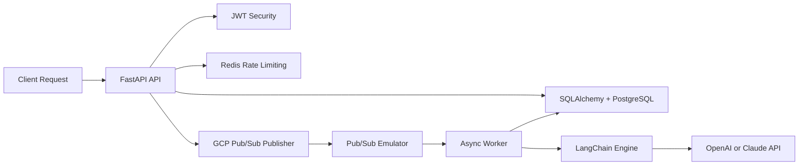
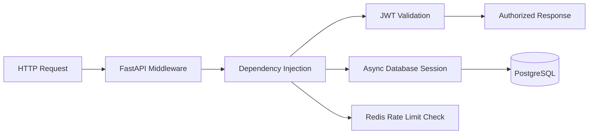
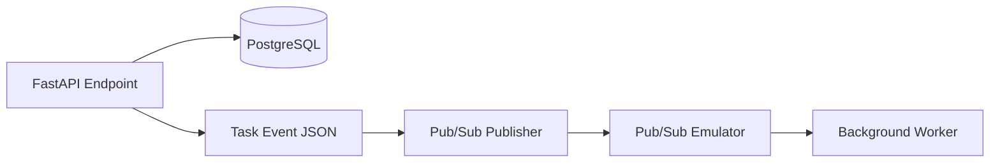
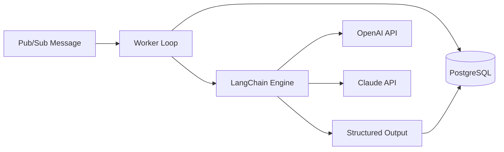

# AI Taskflow Study Plan & Development Roadmap

This document is the detailed study guide for the AI Taskflow project.
It is written for a developer who already understands software architecture and wants to learn the modern Python backend ecosystem by building a realistic project.

The goal is not to learn Python from zero.
The goal is to map familiar backend concepts to Python equivalents and build a production-style async system step by step.

## 1. What This Project Really Is

AI Taskflow is a proof of concept for a task-processing backend.

The project will behave like a small internal platform that:

- Accepts API requests to create a task.
- Validates and authenticates the caller.
- Stores the task in PostgreSQL with an initial status.
- Publishes an event to a message bus so the work can continue in background.
- Lets a worker consume the event and run an LLM-based workflow.
- Saves the AI result back to the database.
- Exposes maintenance operations for scheduled jobs.
- Uses tests, type checking, linting, and formatting as quality gates.
- Runs locally with Docker Compose.

In short, the project is a miniature event-driven AI backend with async APIs, persistence, messaging, background processing, and operational tooling.

## 2. Architectural Vision

The system is split into three main runtime responsibilities:

- API layer: request handling, validation, authentication, persistence, and event publication.
- Messaging layer: asynchronous transport of task identifiers.
- Worker layer: background AI processing and result persistence.



## 3. Why These Technologies Are in the Stack

### FastAPI and Uvicorn

FastAPI is the HTTP API framework.
Uvicorn is the ASGI server that runs it.

Together they model the same idea as ASP.NET Core Web API plus a host/server runtime.

### SQLAlchemy and Alembic

SQLAlchemy is the persistence layer.
Alembic handles schema versioning and migrations.

Together they play the role of EF Core plus migrations.

### PostgreSQL and psycopg2-binary

PostgreSQL stores the task records and final AI outputs.
psycopg2-binary provides the PostgreSQL driver for synchronous tooling paths such as Alembic CLI migrations.
asyncpg provides the asynchronous PostgreSQL driver for the FastAPI runtime and SQLAlchemy Async sessions.

The connection URL for the async application path should use the `postgresql+asyncpg://` prefix.

### Redis

Redis is used for low-latency state, especially rate limiting and temporary operational data.

### PyJWT

PyJWT handles token generation and validation for protected endpoints.

### Pydantic and pydantic-settings

Pydantic provides typed data contracts, validation models, and structured AI output schemas.
pydantic-settings provides typed application configuration from environment variables.

### Requests

Requests is used for simple synchronous HTTP calls, especially for scheduled job simulations and integration scripts.

### Google Cloud Scheduler and Pub/Sub

Google Cloud Scheduler represents scheduled execution.
Google Cloud Pub/Sub represents event-driven messaging.

In the local environment, the Pub/Sub emulator is used instead of the cloud service.

### LangChain and Model Providers

LangChain orchestrates prompts, model calls, and structured outputs.
The project will support both OpenAI and Anthropic Claude integrations.

### Poetry, Pytest, Ruff, MyPy, and Pre-commit

These tools keep the project reproducible, testable, and safe to evolve.

### Docker and Docker Compose

Docker packages the app and services.
Docker Compose runs the full local stack with one command.

## 4. Suggested Project Layout

The project keeps the code separated by responsibility.

```text
ai-taskflow/
├── .github/
├── .pre-commit-config.yaml
├── docker-compose.yml
├── pyproject.toml
├── alembic.ini
├── migrations/
├── src/
│   └── ai_taskflow/
│       ├── __init__.py
│       ├── core/
│       │   ├── __init__.py
│       │   ├── config.py
│       │   ├── security.py
│       │   └── database.py
│       ├── models/
│       │   └── task.py
│       ├── schemas/
│       │   ├── task.py
│       │   └── ai.py
│       ├── api/
│       │   ├── deps.py
│       │   └── v1/
│       │       ├── auth.py
│       │       ├── tasks.py
│       │       └── maintenance.py
│       ├── services/
│       │   ├── cache.py
│       │   └── publisher.py
│       ├── worker/
│       │   ├── main.py
│       │   └── ai_engine.py
│       └── main.py
└── tests/
    ├── conftest.py
    ├── test_auth.py
    └── test_tasks.py
```

Current repository structure (after Phase 1 foundation):

```text
ai-taskflow/
└── src/
    └── ai_taskflow/
        ├── __init__.py
        └── core/
            ├── __init__.py
            └── config.py
```

## 5. The Main Business Flow

The application is centered on a task lifecycle.

1. A client submits a task request.
2. The API validates the request and checks the JWT token.
3. The API checks Redis to protect against abusive traffic.
4. The API stores the task in PostgreSQL with status `PENDING`.
5. The API publishes a message containing the task ID.
6. The worker receives the message asynchronously.
7. The worker loads task data from the database.
8. The worker sends the prompt to OpenAI or Claude through LangChain.
9. The worker stores the generated result and marks the task as `COMPLETED`.

This is the core behavior the project will demonstrate.

## 6. Development Roadmap

### Phase 1: Quality, Static Verification, and Local Infrastructure

Status: Completed

Purpose:

- Create the foundation for a maintainable Python project.
- Make sure dependency management, linting, type checking, and commit hooks are in place before real features start.
- Prepare the local environment so the next phases can focus on application logic instead of setup problems.

What was established:

- Poetry for dependency and environment management.
- Ruff for linting and formatting.
- MyPy for static type checking.
- Pre-commit for local quality gates.
- The initial Docker Compose base for local services.

What this phase teaches:

- Reproducible project setup.
- Quality gates before commit and before CI.
- How to keep a study project aligned with professional engineering habits.

### Phase 2: API Core, Authentication, and Persistence

Purpose:

- Build the actual application backbone.
- Connect request handling, security, and database persistence.
- Establish the patterns that the rest of the project will reuse.

Key tasks:

- Implement typed application settings in `src/ai_taskflow/core/config.py`.
- Use `pydantic-settings` to load environment variables safely and explicitly.
- Configure the async SQLAlchemy engine and session factory in `src/ai_taskflow/core/database.py`.
- Use the `postgresql+asyncpg://` connection string for the async runtime path.
- Initialize Alembic and create the first database migration.
- Implement JWT encode and decode helpers in `src/ai_taskflow/core/security.py`.
- Add FastAPI dependency helpers in `src/ai_taskflow/api/deps.py`.
- Create task-related endpoints in `src/ai_taskflow/api/v1/tasks.py`.
- Add Redis-backed rate limiting in `src/ai_taskflow/services/cache.py`.

Request flow:



What the final result of this phase should look like:

- A request can reach the API.
- Authentication is validated.
- A database session is injected cleanly.
- A task row is created in PostgreSQL.
- The task starts with a clear initial state such as `PENDING`.
- Abuse control is in place through Redis.

What this phase teaches:

- FastAPI request lifecycle.
- Dependency injection as a composition mechanism.
- Async database access patterns.
- Secure API design.
- Operational safeguards with Redis.

### Phase 3: Event-Driven Architecture and Messaging

Purpose:

- Decouple API latency from AI processing latency.
- Turn task creation into an event-producing operation.
- Prepare the system for distributed work.

Key tasks:

- Add the Google Cloud Pub/Sub emulator to `docker-compose.yml`.
- Add local topic and subscription bootstrap scripts.
- Implement a publisher service in `src/ai_taskflow/services/publisher.py`.
- Publish the task ID after the database commit succeeds.
- Keep the API response fast and avoid waiting for the LLM call.

Flow overview:



What the final result of this phase should look like:

- The API creates a task and immediately returns.
- The task is stored in PostgreSQL first.
- A message is published with only the data needed for background work.
- The worker is able to react independently.

What this phase teaches:

- Event-driven design.
- Asynchronous decoupling.
- Reliable post-commit publishing.
- The difference between API latency and background processing latency.

### Phase 4: AI Engine with LangChain

Purpose:

- Build the worker that turns task events into AI-driven output.
- Integrate the model providers behind a structured orchestration layer.
- Persist the AI result as part of the task lifecycle.

Key tasks:

- Create the worker entry point in `src/ai_taskflow/worker/main.py`.
- Consume messages from the Pub/Sub subscription.
- Load the task details from PostgreSQL.
- Configure LangChain in `src/ai_taskflow/worker/ai_engine.py`.
- Support both `ChatOpenAI` and `ChatAnthropic`.
- Create prompt templates that adapt to the task type.
- Define a Pydantic response contract for the AI output in `src/ai_taskflow/schemas/ai.py`.
- Enforce structured output with `with_structured_output()` so the worker writes predictable results.
- Update the task status to `COMPLETED` after the AI response is saved.

Worker flow:



What the final result of this phase should look like:

- The worker can run independently from the API.
- The worker processes messages asynchronously.
- The task content is turned into a prompt.
- The LLM result is formatted in a controlled way.
- The result is stored back in the database.

What this phase teaches:

- Background worker design.
- Prompt engineering.
- Provider abstraction with LangChain.
- Structured AI outputs.
- Result persistence and state transitions.

### Phase 5: Scheduled Jobs and External Integrations

Purpose:

- Add operational tasks that support the application over time.
- Simulate cloud-driven maintenance jobs.
- Keep the system realistic from an infrastructure perspective.

Key tasks:

- Add a protected maintenance endpoint in `src/ai_taskflow/api/v1/maintenance.py`.
- Create a Redis cleanup workflow in `src/ai_taskflow/services/cache.py` or a related service module.
- Build a scheduler simulation helper in `src/ai_taskflow/services/scheduler_simulation.py`.
- Use Requests to call the maintenance endpoint as if Google Cloud Scheduler had triggered it.

What the final result of this phase should look like:

- The app has a clear place for recurring maintenance actions.
- The maintenance flow is protected and controlled.
- The project shows how scheduled cloud jobs map to HTTP endpoints.

What this phase teaches:

- Scheduled operations.
- Maintenance endpoint design.
- External HTTP automation.
- The boundary between application logic and operational concerns.

### Phase 6: Automated Testing and Async Reliability

Purpose:

- Prove that the system behaves correctly.
- Protect the project from regressions.
- Make async behavior testable and repeatable.

Key tasks:

- Configure async fixtures in `tests/conftest.py`.
- Isolate the test database lifecycle.
- Test JWT helpers in `tests/test_auth.py`.
- Test task endpoints in `tests/test_tasks.py`.
- Use async test clients for end-to-end request coverage.
- Validate Redis rate limiting behavior.
- Validate database persistence and task status transitions.

What the final result of this phase should look like:

- The main flows are covered by automated tests.
- Async code is tested without blocking patterns.
- Security and persistence logic are verified.
- The project is ready to evolve safely.

What this phase teaches:

- Test isolation.
- Async integration testing.
- API behavior verification.
- Quality assurance as a continuous discipline.

## 7. Recommended Implementation Order

The best order for implementation is:

1. Finish the core configuration and environment setup.
2. Implement the database and authentication foundation.
3. Add the first task creation endpoint.
4. Add Redis rate limiting.
5. Introduce Pub/Sub publishing.
6. Build the worker and LangChain integration.
7. Add scheduled maintenance flows.
8. Expand the automated test suite.
9. Keep documenting the architecture as the project grows.

## 8. Practical Study Outcome

By the end of this project, you should be able to:

- Build a modern async Python API.
- Model data and manage migrations with SQLAlchemy and Alembic.
- Secure endpoints with JWT.
- Use Redis for operational concerns.
- Implement event-driven processing with Pub/Sub.
- Orchestrate LLM workflows with LangChain.
- Validate the system with linting, type checking, and tests.
- Run the whole stack locally with Docker Compose.

## 9. Relationship to the Main README

The main [README.md](README.md) contains the short project overview and the stack summary.
This file is the detailed roadmap, study guide, and implementation blueprint.